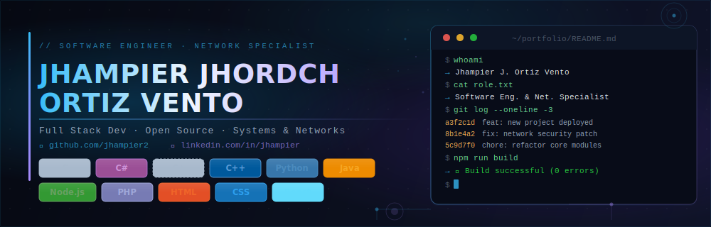

# ¡Hola! Soy Jhampier 👋

**Software Engineer & Network Specialist**  
Full-Stack | Open Source | Sistemas y Redes

-  Actualmente trabajando en **CENTRO DE TECNOLOGÍA Y CRÉDITO DEL PERÚ**
-  Aprendiendo más sobre **cloud & DevOps**
-  Contacto: [LinkedIn](https://www.linkedin.com/in/jhampier-jhordch-ortiz-vento-62675230a/) · [GitHub](https://github.com/jhampier2)

---

##  Tecnologías y herramientas

---

##  Estadísticas de GitHub

